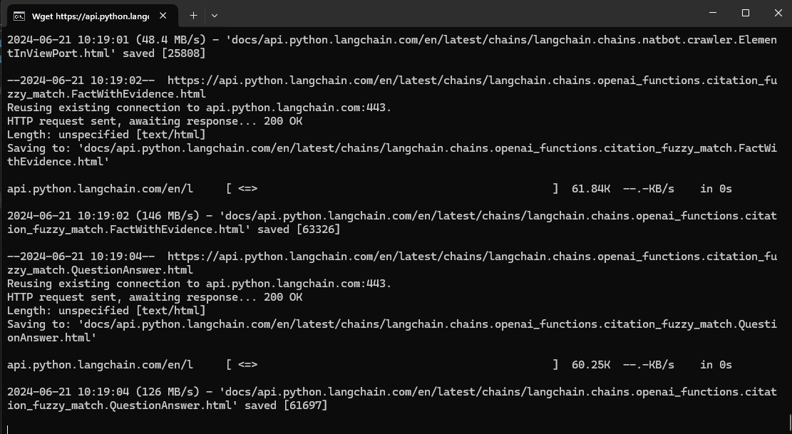
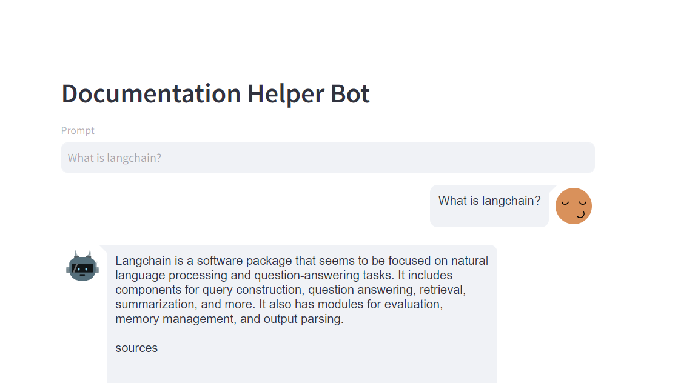

# Documentation Chatbot Assistant

Simple Documentation Chat Assistant app that allows you to query your documents based on queried text through Streamlit frontend.

## Downloading of API documentation

(Note that only Langchain Documentation has been verified.)
Assuming you have wget setup on your machine. Otherwise refer to *(For Windows Users) Additional notes for wget utility setup* section

```
wget -r --no-parent --html-extension --wait=1 --random-wait -P docs <API Documentation Reference link>
```

Successful wget output:


Additional notes: Please include the options "--wait" and "--random-wait" to introduce a wait with varied duration to avoid "429 error: Too many requests" as a result of mass request.

**Langchain API Documentation example download**
```
wget -r --no-parent --html-extension --wait=1 --random-wait -P docs https://api.python.langchain.com/en/latest/langchain_api_reference.html
```

Additional notes: Please include the options "--wait" and "--random-wait" to introduce a wait with varied duration to avoid "429 error: Too many requests" as a result of mass request. Due to large number of files (about 5K to be downloaded), please cater sufficient time for full download.

Alternatively, you may download the zip folder from this [download link](https://www.dropbox.com/scl/fi/0y1321mii7iwdlzwk1ar1/api.python.langchain.com.zip?rlkey=rlmmornwspeu4fp995wycpfsr&st=kphywc6b&dl=0), and extract to *docs* subfolder under this repository instead.

## Environment file to edit

Please create an *.env* file with the following parameters. PYTHONPATH is required to be filled to ensure successful folder imports in project.

```
OPENAI_API_KEY = <YOUR API KEY>
PINECONE_INDEX = <YOUR PINECONE INDEX CREATED for storing embedded documents> (Please note the dimensions to be created must correspond to output dimension of your embedding model. OpenAIEmbedding text-embedding-3-small results in 1536 dimensional vector)
PINECONE_API_KEY = <YOUR API KEY>

# Optional if you are not using LangSmith for tracking llm utilisation related metrics
LANGCHAIN_API_KEY=<YOUR API KEY>
LANGCHAIN_TRACING_V2=true
```

For more information on Langsmith, refer to [here](https://www.langchain.com/langsmith).

## Installation and Execution

1. Please use Anaconda distribution to install the necessary libraries with the following command

```
conda env create -f environment.yml
```

2. Ingest the data into Pinecone first. Otherwise, the program would fail. To do this, please execute the following command to start the ingestion. As the code did not use any asynchronous implementation, ingestion will be take up a significant time

```
python ingestion.py
```

3. Upon completion of ingestion, run the following command with *Streamlit* and preferred port number:

```
streamlit run main.py --server.port <your port>
```

Note that without --server.port specified, port 8501 would be used by default if available. Otherwise, streamlit will use the next available higher port number.

4. Subsequently you can access the page via http://localhost:\<port number\> as shown below (with sample input provided and response):



## Limitations

Please note that this repository is not PRODUCTION ready, hence performance suffers when there are more conversation and conversation history may breach model token limits due to concatenation, resulting in LLM model not being able to respond.

## Important note on Pinecone VectorStore for document embedding

The index dimensions for this repo is **3072** which is based on OpenAI latest embedding model "text-embedding-3-large" which is better performing model than default text-embedding-ada-002. In the event that other embedding models are to be used in code, a new Pinecone index with compatible dimension has to be created with the correct dimensions.

### (For Windows Users) Additional notes for wget utility setup:

As the inbuilt *wget* library does not support the command above, you would need to download wget library (tested with v1.21.4) from https://eternallybored.org/misc/wget/ and place it in the directory *C:\Windows\System32 folder*.

## Programming languages/tools involved

- Python
- Langchain
    - ChatOpenAI
    - TextSplitters: RecursiveTextSplitter
    - VectorStores: Pinecone, FAISS
    - RetrievalQA for direct Question-Answering on local documents 
    - ConversationalRetrievalChain for Question-Answering on local documents with follow-ups on past queries

## Acknowledgement and Credits

The codebase developed are in reference to *Section 6: Building a documentation assistant(Embeddings, VectorDBs, Retrieval, Memory)* of Udemy course titled "LangChain- Develop LLM powered applications with LangChain" available via https://www.udemy.com/course/langchain.

- Wget setup for Windows: Download and install wget : https://phoenixnap.com/kb/wget-command-with-examples
- *download_docs.py*: Originated from Udemy course author, with some code amendment to process from .env file